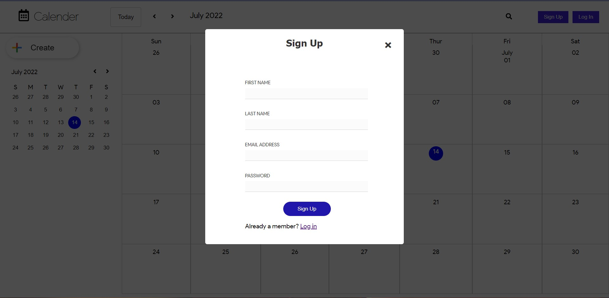

# Calendar Web App
	
Ultimate calendar app using  React JS.
 - Pick days, months, or years.
-   Supports range selection
-   Schedule an Event 
-  Create your personal account 

## Technology Used

> FrontEnd

 - HTML
 - CSS
 - React JS
 > BackEnd
 - Express JS
 > Database
 - Mongo DB

## Project Images





## Installation
&nbsp;
>### FrontEnd Installation
&nbsp;
```sh
cd frontend
npm install
npm start
```

&nbsp;
>### Backend Installation
&nbsp;
```sh
cd server
npm install
npm start
```
